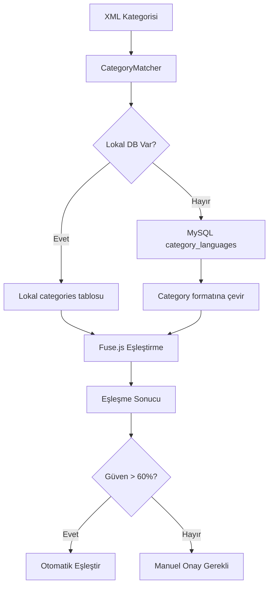

# CategoryMatcher - Gerçek Veritabanı Entegrasyonu

## ✅ Yapılan Güncelleme

### 1. Demo Kategoriler Kaldırıldı
- ❌ Demo/sahte kategoriler artık kullanılmıyor  
- ✅ Sadece gerçek veritabanı kategorileri kullanılıyor

### 2. Veritabanı Öncelik Sırası

Kategori eşleştirmesi artık şu sırayla çalışıyor:

1. **Önce lokal veritabanı** (`categories` tablosu)
   ```sql
   SELECT * FROM categories;
   ```

2. **Sonra MySQL** (`category_languages` tablosu) 
   ```sql
   SELECT id, category_id, title FROM category_languages 
   WHERE title IS NOT NULL AND title != "";
   ```

3. **Hiçbiri başarısız olursa hata fırlatır**
   ```
   "Kategoriler alınamadı - hem lokal hem de MySQL veritabanında hata oluştu"
   ```

### 3. MySQL Entegrasyonu

CategoryMatcher artık gerçek MySQL `category_languages` tablosundaki kategorilerle eşleştirme yapacak:

```typescript
// MySQL'den çekilen kategori formatı
{
  id: number,           // MySQL'deki id
  categoryId: number,   // category_id field'ı (asıl kategori ID)  
  title: string         // Kategori adı
}

// Category schema formatına çevriliyor
{
  id: string,           // categoryId.toString() 
  name: string,         // title field'ı
  parentId: null,       // MySQL'de parent yoksa
  description: null,
  isActive: true,
  sortOrder: null,
  createdAt: Date,
  updatedAt: Date
}
```

### 4. Gerçek Eşleştirme Akışı



### 5. Avantajlar

- **🎯 Gerçek veriler**: Artık sadece gerçek kategori verileri kullanılıyor
- **🔄 Fallback sistemi**: Bir veritabanı çalışmazsa diğerini dener  
- **📊 Tutarlı format**: MySQL kategorileri standart formata dönüştürülüyor
- **⚡ Hızlı eşleştirme**: Fuse.js ile milisaniye seviyesinde sonuç

### 6. Test Etmek İçin

```bash
# Veritabanı bağlantısını test et
curl http://localhost:3000/api/categories

# Kategori eşleştirmeyi test et  
curl http://localhost:3000/api/xml-sources/[ID]/auto-map-categories
```

### 7. Sorun Giderme

Eğer kategoriler gelmiyorsa:

1. **Veritabanı bağlantı ayarlarını kontrol edin**
2. **MySQL'de `category_languages` tablosuna erişim var mı kontrol edin**
3. **Console loglarında hata mesajlarını kontrol edin**

Artık CategoryMatcher tamamen gerçek verilerle çalışıyor! 🚀
